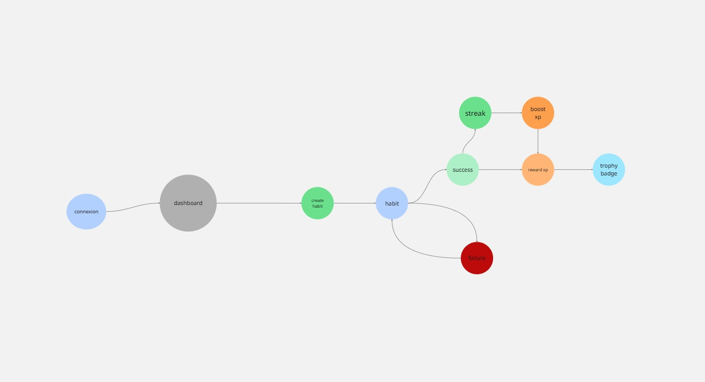
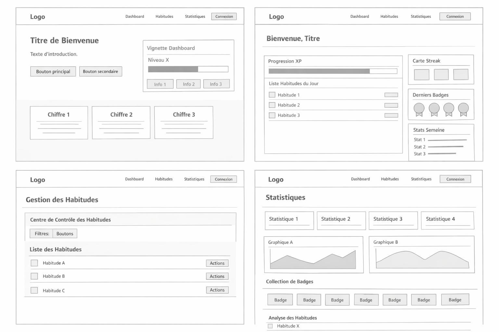
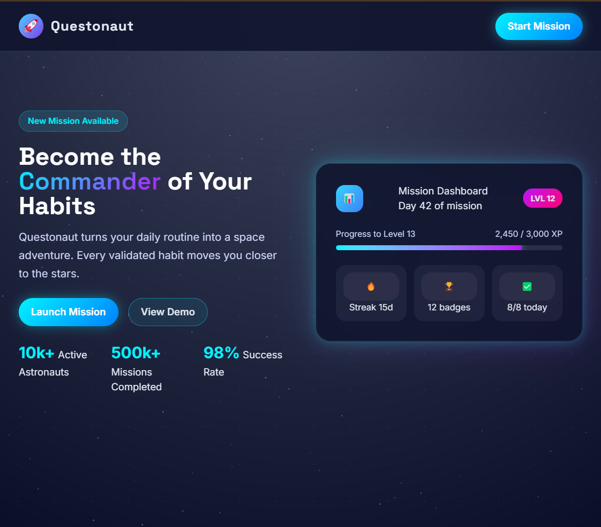
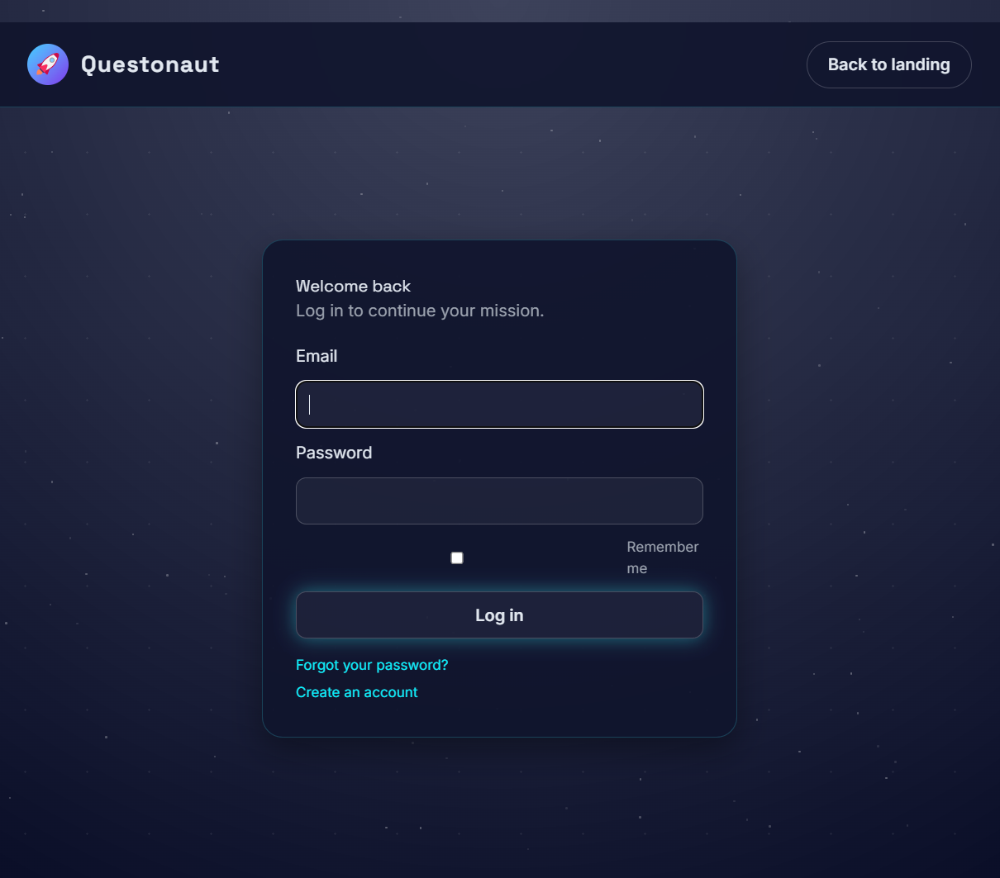
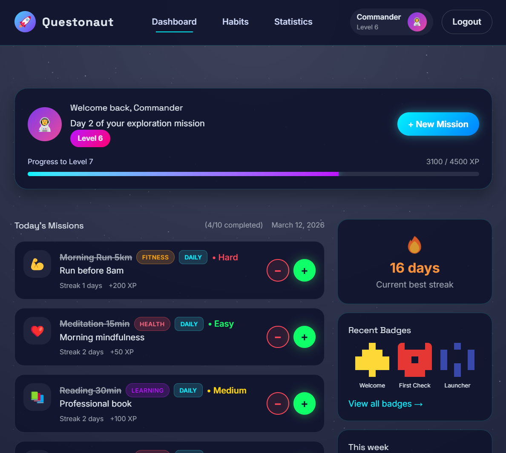
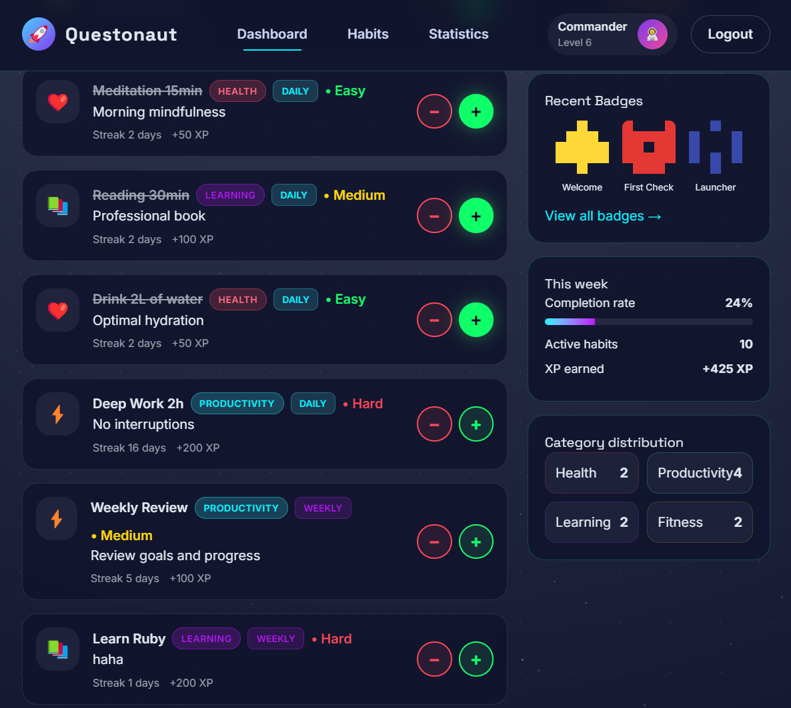
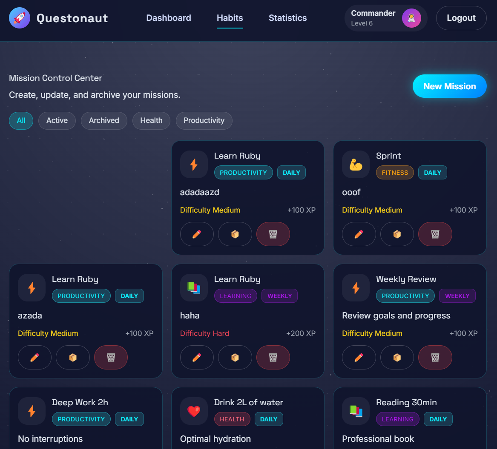
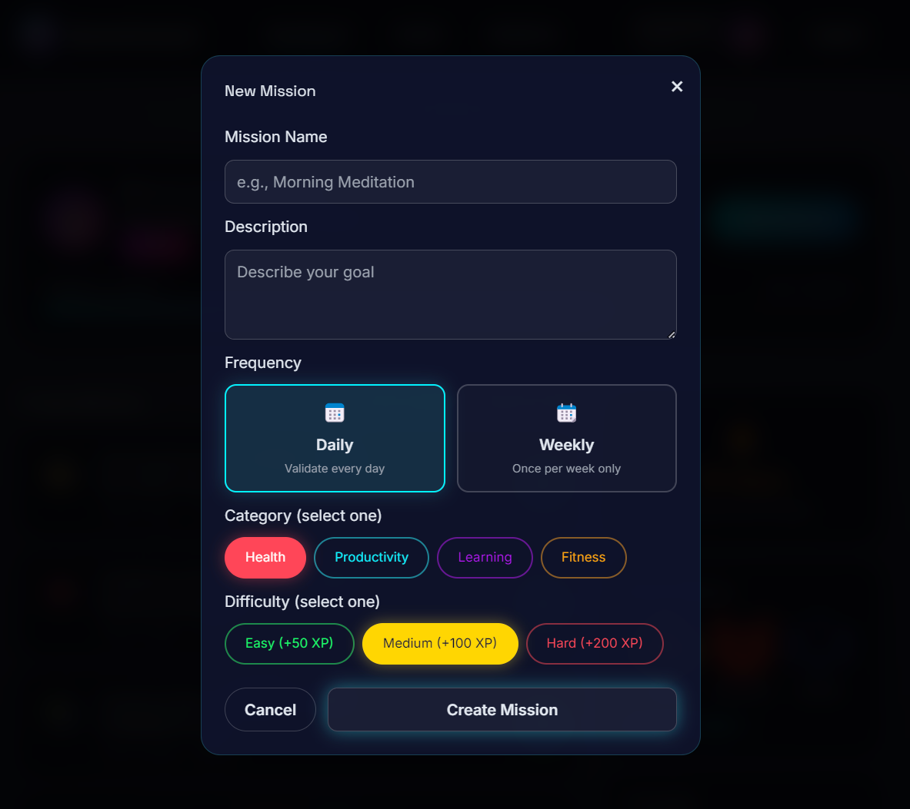
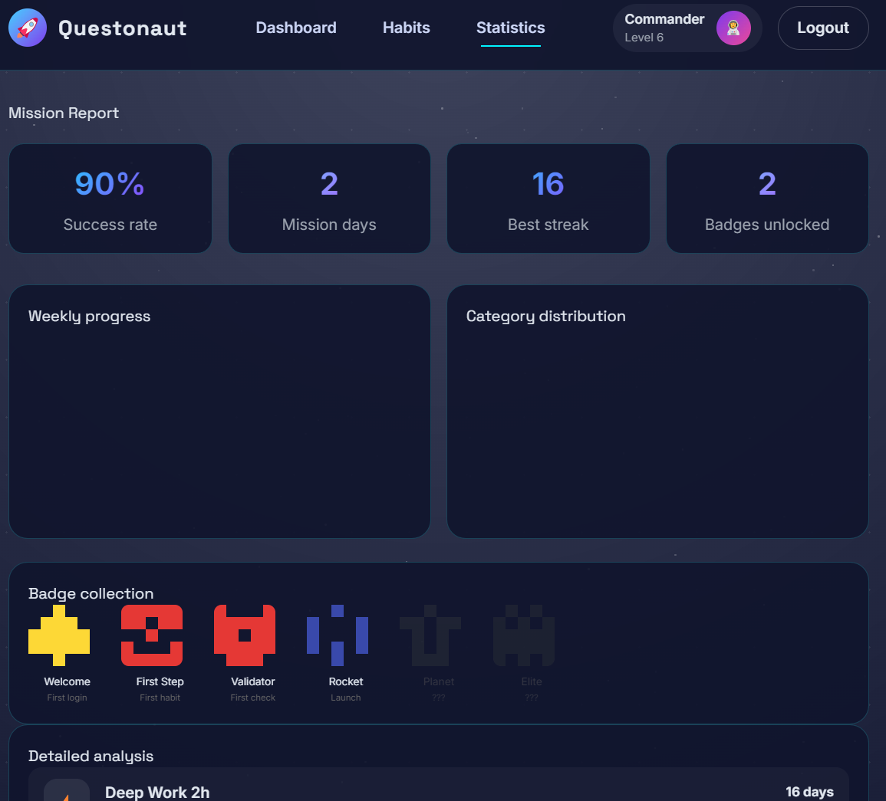

# Questonaut - Habit Tracker App - Projet Final THP

## 📝 Présentation

Ce projet est conçu et développé sur une quinzaine de jours en suivant la **méthodologie Agile**, structurée autour de **user stories**. Cette approche nous a permis d’organiser le développement par étapes courtes et d’aboutir rapidement à une **version fonctionnelle de l’application**.

L’objectif de cette démarche est triple :

• **Concevoir une application web complète et réaliste**, capable de démontrer notre capacité à développer un produit structuré et utilisable.

• **Appliquer une méthodologie de développement claire**, qui permet de transformer une idée en produit concret sans être paralysé par la complexité initiale d’un projet.

• **Se concentrer sur un MVP (Minimum Viable Product)** : une première version simple mais fonctionnelle, qui constitue la base pour faire évoluer l’application et ajouter progressivement de nouvelles fonctionnalités.

Cette approche nous permet de construire un produit de manière pragmatique : **livrer rapidement une première version utile**, puis l’améliorer en continu.

# 🚀 Questonaut – Habit Tracker

Questonaut est une application web de **suivi d’habitudes gamifiée** qui aide les utilisateurs à rester réguliers dans leurs objectifs personnels grâce à un système simple de validation quotidienne et de progression.

---

# 📜 Executive Summary

### Présentation

Nous comptons développer **Questonaut**, une application web de suivi d’habitudes destinée aux personnes souhaitant atteindre leurs objectifs personnels sur le long terme. L’application s’inscrit dans l’univers concurrentiel des outils de productivité et de développement personnel.

Aujourd’hui, de nombreuses personnes souhaitent adopter de bonnes routines — faire du sport, apprendre une nouvelle compétence ou maintenir une discipline quotidienne — mais abandonnent souvent par manque de motivation et de suivi. Questonaut propose de résoudre ce problème grâce à un système simple de validation quotidienne des habitudes, combiné à des mécanismes de **gamification** qui encouragent la régularité.

L’univers visuel de l’application s’inspire de **l’exploration spatiale** : chaque habitude devient une mission et chaque progrès représente une avancée dans une quête personnelle. L’utilisateur peut créer ses habitudes, suivre sa progression et gagner de l’expérience, des niveaux et des badges au fil du temps.

---
### Business Model

Questonaut proposera une application web accessible aux utilisateurs souhaitant améliorer leur discipline personnelle et suivre leurs habitudes.

Dans un premier temps, l’application sera proposée dans une **version gratuite avec les fonctionnalités essentielles** (création d’habitudes, suivi quotidien, historique).

À terme, le modèle pourra évoluer vers :

- une **version premium** avec des fonctionnalités avancées (statistiques détaillées, défis, personnalisation)
- des **défis ou programmes thématiques** (sport, productivité, bien-être)
- éventuellement des **partenariats ou contenus spécialisés** autour du développement personnel.

---
### L’équipe en place

L’équipe est composée d'étudiants développeurs travaillant sur la conception et la réalisation technique du projet.

- Théo VILLALBA
- Allen KOCH
- William MAHI

Les membres de l’équipe se répartissent les rôles suivants :

- développement **backend** (Ruby on Rails et base de données)
- développement **frontend** (interface utilisateur et interactions)
- intégration des fonctionnalités
- amélioration de l’**expérience utilisateur et du design**.

Le projet bénéficie également de l’accompagnement d’un **mentor technique**, Dimitri Kiavu (ancien élève de THP).

---
### Nos clients

Notre cible principale est constituée de personnes souhaitant améliorer leur discipline personnelle et maintenir des routines dans leur quotidien.

Les utilisateurs potentiels incluent notamment :

- les étudiants souhaitant structurer leur travail
- les jeunes actifs cherchant à améliorer leur productivité
- les personnes intéressées par le **développement personnel**
- toute personne souhaitant suivre ses habitudes et rester motivée dans la durée.

---
### Nos résultats à date

Le produit est actuellement **en phase de développement** et n’a pas encore été lancé publiquement.

Les premières étapes consistent à développer un **MVP (Minimum Viable Product)** permettant aux utilisateurs de :

- créer un compte
- créer et gérer leurs habitudes
- valider leurs actions quotidiennes
- suivre leur progression.

---
### Nos résultats escomptés dans 3 ans

À moyen terme, l’objectif est de développer une application complète intégrant des mécanismes avancés de gamification (XP, niveaux, badges, statistiques et défis).

Questonaut ambitionne de devenir une **référence parmi les applications de suivi d’habitudes**, en proposant une expérience à la fois motivante, simple et immersive grâce à son univers inspiré de l’exploration spatiale.

L’objectif à long terme est d’élargir la plateforme avec de nouvelles fonctionnalités et de construire une communauté active d’utilisateurs engagés dans leur progression personnelle.

---

# 🧭 Parcours utilisateur (MVP)

1️⃣ L’utilisateur arrive sur la **page d’accueil** qui présente l’application et son concept : suivre ses habitudes comme une mission d’exploration.

2️⃣ Il crée un compte avec son **email et un mot de passe**.

3️⃣ Une fois connecté, il arrive sur son **dashboard personnel**.

4️⃣ L’utilisateur peut créer une nouvelle habitude en renseignant :

- 📝 un nom
    
- 📄 une description
    
- 🏷 une catégorie
    
- ⚡ un niveau de difficulté
    

5️⃣ Chaque jour, il peut **valider les habitudes qu’il a réalisées**.

* Il peut valider via bouton + ou -
* Si bouton + vert = habitude validée
* Si bouton - rouge = habitude non validée (pas de pénalité d'xp MAIS la streak est reset pour cette habit)
* Une habitude ne peut être validé qu'une fois par jour/semaine

6️⃣ Lorsqu’une habitude est validée :

- ⭐ l’utilisateur gagne de l’XP
    
- 📈 sa progression augmente
    
- 🏅 il peut débloquer des badges ou monter de niveau
    

7️⃣ Le dashboard lui permet de visualiser :

- 📋 ses habitudes
    
- 📊 sa progression
    
- 🏆 ses badges
    
- 🚀 son niveau actuel

---

# 👤 Personas

|Persona|Profil|Contexte|Objectif principal|Frustrations|Attentes clés|Fonctionnalités importantes|
|---|---|---|---|---|---|---|
|**Étudiant organisé**|Lucas Martin — 22 ans — étudiant en informatique|Beaucoup de projets (cours, code, sport, lecture) mais difficulté à rester régulier|Structurer ses journées et construire une routine stable|Apps trop complexes, perte de motivation, progrès peu visibles|Interface simple, progression visible, récompenses visuelles|Streaks, progression XP, dashboard clair, statistiques hebdomadaires|
|**Sport / remise en forme**|Sarah Dubois — 31 ans — marketing|Veut maintenir des habitudes santé malgré un rythme de travail chargé|Maintenir une routine sportive et bien-être|Perte de motivation rapide, apps fitness trop complexes|Validation rapide des habitudes, suivi des progrès|Streak tracking, historique d’habitudes, badges, progression hebdomadaire|
|**Professionnel discipliné**|Marc Lefèvre — 38 ans — entrepreneur / freelance|Gère travail, tâches administratives et organisation quotidienne|Structurer une discipline quotidienne|Outils trop lourds, difficulté à maintenir la régularité|Application rapide et efficace|Checklist quotidienne, historique des accomplissements, statistiques mensuelles|
|**Motivé par le challenge**|Julien — 27 ans — employé / étudiant|Intéressé par les challenges personnels et la progression|Transformer ses routines en défis motivants|Applications trop austères et peu engageantes|Gamification, progression ludique|XP, niveaux, badges, streaks, progression visuelle|

---
### Synthèse produit

| Persona       | Besoin principal                    | Fonction clé                  |
| ------------- | ----------------------------------- | ----------------------------- |
| Étudiant      | structurer ses journées             | streak + progression          |
| Sport         | maintenir motivation                | suivi régulier                |
| Professionnel | discipline quotidienne              | validation rapide             |
| Compétitif    | maintenir motivation via challenges | streak + progression visuelle |

---
# 🖼 Wireframe

---
# 📱 Maquette - Design Layout

### Landing Page

### Login / SignUp

### Dashboard

### Habits

### Create new mission

### Stats

---

# 🛠 Tech Stack

### Backend

- **Ruby on Rails** — framework principal (architecture MVC, API REST, ActiveRecord)
    
- **Devise** — authentification (signup, login, gestion des sessions)
    
- **SQLite** — base de données pour le développement et le MVP
    

### Frontend

- **Hotwire** — interfaces dynamiques sans SPA
    
- **Turbo** — navigation rapide et mises à jour partielles
    
- **Stimulus** — gestion des interactions frontend
    
- **Tailwind CSS** — design et layout responsive
    
- **Sass** (via `sass-embedded`) — organisation modulaire du CSS
    

### Outils de développement

- **RSpec** — tests
    
- **RuboCop** — qualité et conventions du code
    
- **Brakeman** — analyse de sécurité
    
- **Administrate** — interface d’administration
    

### Gems utilitaires

- **Faker** — génération de données de test
    
- **Pry** — debugging interactif
    
- **Dotenv** — gestion des variables d’environnement
    
- **TablePrint** — affichage formaté en console

---
# MVP

Le MVP devra permettre :

- 👤 créer un compte
- 🔐 se connecter
- 📌 créer une habitude (nom, description, catégorie)
- 📋 voir la liste de ses habitudes
- ✅ valider une habitude pour la journée
- 📅 consulter l’historique de validation
- 💾 enregistrer les validations en base de données

Interface simple :

Dashboard utilisateur  
liste des habitudes  
bouton **“valider aujourd’hui”**

❗ La gamification reste limitée au MVP (progression simple).

### Version minimaliste

La version minimaliste de l’application est la suivante :

Un utilisateur peut créer un compte puis se connecter à son espace personnel.

Depuis son **dashboard**, il peut :

- créer une habitude
    
- consulter la liste de ses habitudes
    
- valider une habitude pour la journée
    

Chaque validation est enregistrée afin de permettre à l’utilisateur de **suivre sa régularité dans le temps**. Un fichier **seed.rb** devra contenir quelques exemples d’utilisateurs et d’habitudes afin de faciliter les tests de l’application.

---
## 📅 Project Planning

Le projet est réalisé sur **5 jours**, avec une approche progressive : 

| Jour          | Objectif principal | Tâches                                                                                                                                                                  |
| ------------- | ------------------ | ----------------------------------------------------------------------------------------------------------------------------------------------------------------------- |
| **Monday**    | Setup & Backend    | Initialisation du projet Rails, configuration des gems, authentification avec Devise, création des modèles principaux                                                   |
| **Tuesday**   | Backend & Features | - Routes, contrôleurs, logique métier, validations d’habitudes, tests - Ajout des premières fonctionnalités (streaks, XP, statistiques simples) - Setup des Views |
| **Wednesday** | Frontend           | Mise en place Architecture Sass, amélioration du dashboard et des composants                                                                                            |
| **Thursday**  | Frontend           | Design UI avec Tailwind + Sass, amélioration du dashboard et des composants                                                                                             |
| **Friday**    | Finalisation & MVP | Polissage UX, corrections, tests, documentation et préparation de la démo et mise en ligne du MVP                                                                       |

---
## 👥 Task Distribution

Le travail est réparti entre **3 développeurs** afin de paralléliser certaines tâches.

| Collaborateur   | Responsabilités                                                             |
| --------------- | --------------------------------------------------------------------------- |
| **Developer 1** | Backend (modèles, logique métier, validations, base de données)             |
| **Developer 2** | Frontend (UI, dashboard, composants Tailwind/Sass)                          |
| **Developer 3** | Features & intégration (gamification, statistiques, intégration API, tests) |

---
